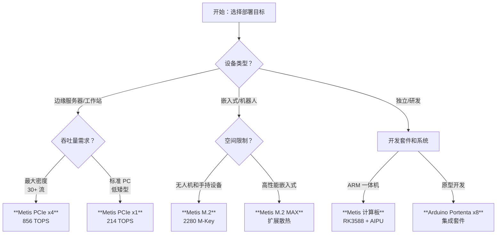

# Axelera AI 导出和部署

!!! tip "实验性版本"

    这是一个展示在 Axelera Metis 硬件上部署的实验性集成。预计在 **2026 年 2 月** 实现完整集成，届时无需 Axelera 硬件即可导出模型，并支持标准 pip 安装。

Ultralytics 与 [Axelera AI](https://www.axelera.ai/) 合作，在[边缘 AI](https://www.ultralytics.com/glossary/edge-ai) 设备上实现高性能、高能效的推理。使用 **Voyager SDK** 将 **Ultralytics YOLO 模型**直接导出并部署到 **Metis® AIPU**。


Axelera AI 为边缘[计算机视觉](https://www.ultralytics.com/glossary/computer-vision-cv)提供专用硬件加速，使用专有数据流架构和[内存计算](https://www.ultralytics.com/glossary/edge-computing)技术，以低功耗实现高达 **856 TOPS** 的性能。

## 选择合适的硬件

Axelera AI 提供各种外形规格以适应不同的部署约束。下图帮助您确定适合 Ultralytics YOLO 部署的最佳硬件。



## 硬件产品组合

Axelera 硬件产品线经过优化，可以高 FPS/瓦特效率运行 [Ultralytics YOLO11](https://docs.ultralytics.com/models/yolo11/) 和旧版本。

### 加速卡

这些卡可在现有主机设备中实现 AI 加速，便于[棕地部署](https://www.ultralytics.com/glossary/edge-computing)。

| 产品              | 外形规格       | 计算能力           | 性能 (INT8)    | 目标应用                                                                                                                           |
| :---------------- | :------------- | :----------------- | :------------- | :--------------------------------------------------------------------------------------------------------------------------------- |
| **Metis PCIe x4** | PCIe Gen3 x16  | **4x** Metis AIPUs | **856 TOPS**   | 高密度[视频分析](https://docs.ultralytics.com/guides/analytics/)、智慧城市                                                         |
| **Metis PCIe x1** | PCIe Gen3 x1   | **1x** Metis AIPU  | **214 TOPS**   | 工业 PC、零售[队列管理](https://docs.ultralytics.com/guides/queue-management/)                                                     |
| **Metis M.2**     | M.2 2280 M-Key | **1x** Metis AIPU  | **214 TOPS**   | [无人机](https://www.ultralytics.com/blog/build-ai-powered-drone-applications-with-ultralytics-yolo11)、机器人、便携式医疗设备     |
| **Metis M.2 MAX** | M.2 2280       | **1x** Metis AIPU  | **214 TOPS**   | 需要高级散热管理的环境                                                                                                             |

### 集成系统

对于交钥匙解决方案，Axelera 与制造商合作提供经过 Metis AIPU 预验证的系统。

- **Metis 计算板**：将 Metis AIPU 与 Rockchip RK3588 ARM CPU 配对的独立边缘设备。
- **工作站**：来自 **Dell**（Precision 3460XE）和 **Lenovo**（ThinkStation P360 Ultra）的企业级塔式机。
- **工业 PC**：来自 **Advantech** 和 **Aetina** 的加固系统，专为[制造自动化](https://www.ultralytics.com/solutions/ai-in-manufacturing)设计。

## 支持的任务

目前，目标检测模型可以导出为 Axelera 格式。其他任务正在集成中：

| 任务                                                               | 状态       |
| :----------------------------------------------------------------- | :--------- |
| [目标检测](https://docs.ultralytics.com/tasks/detect/)             | ✅ 已支持  |
| [姿态估计](https://docs.ultralytics.com/tasks/pose/)               | 即将推出   |
| [分割](https://docs.ultralytics.com/tasks/segment/)                | 即将推出   |
| [旋转边界框](https://docs.ultralytics.com/tasks/obb/)              | 即将推出   |

## 安装

!!! warning "平台要求"

    导出为 Axelera 格式需要：

    - **操作系统**：仅限 Linux（推荐 Ubuntu 22.04/24.04）
    - **硬件**：Axelera AI 加速器（[Metis 设备](https://store.axelera.ai/)）
    - **Python**：版本 3.10（3.11 和 3.12 即将支持）

### Ultralytics 安装

```bash
pip install ultralytics
```

有关详细说明，请参阅我们的 [Ultralytics 安装指南](../quickstart.md)。如果遇到困难，请查阅我们的[常见问题指南](../guides/yolo-common-issues.md)。

### Axelera 驱动安装

1. 添加 Axelera 仓库密钥：

    ```bash
    sudo sh -c "curl -fsSL https://software.axelera.ai/artifactory/api/security/keypair/axelera/public | gpg --dearmor -o /etc/apt/keyrings/axelera.gpg"
    ```

2. 将仓库添加到 apt：

    ```bash
    sudo sh -c "echo 'deb [signed-by=/etc/apt/keyrings/axelera.gpg] https://software.axelera.ai/artifactory/axelera-apt-source/ ubuntu22 main' > /etc/apt/sources.list.d/axelera.list"
    ```

3. 安装 SDK 并加载驱动：

    ```bash
    sudo apt update
    sudo apt install -y axelera-voyager-sdk-base
    sudo modprobe metis
    yes | sudo /opt/axelera/sdk/latest/axelera_fix_groups.sh $USER
    ```

## 将 YOLO 模型导出到 Axelera

使用标准 Ultralytics 导出命令导出您训练好的 YOLO 模型。

!!! example "导出为 Axelera 格式"

    === "Python"

        ```python
        from ultralytics import YOLO

        # 加载 YOLO11 模型
        model = YOLO("yolo11n.pt")

        # 导出为 Axelera 格式
        model.export(format="axelera")  # 创建 'yolo11n_axelera_model' 目录
        ```

    === "CLI"

        ```bash
        yolo export model=yolo11n.pt format=axelera
        ```

### 导出参数

| 参数       | 类型             | 默认值           | 描述                                                                                 |
| :--------- | :--------------- | :--------------- | :----------------------------------------------------------------------------------- |
| `format`   | `str`            | `'axelera'`      | Axelera Metis AIPU 硬件的目标格式                                                    |
| `imgsz`    | `int` 或 `tuple` | `640`            | 模型输入的图像尺寸                                                                   |
| `int8`     | `bool`           | `True`           | 为 AIPU 启用 [INT8 量化](https://www.ultralytics.com/glossary/model-quantization)    |
| `data`     | `str`            | `'coco128.yaml'` | 用于量化校准的[数据集](https://docs.ultralytics.com/datasets/)配置                   |
| `fraction` | `float`          | `1.0`            | 用于校准的数据集比例（推荐 100-400 张图像）                                          |
| `device`   | `str`            | `None`           | 导出设备：GPU（`device=0`）或 CPU（`device=cpu`）                                    |

有关所有导出选项，请参阅[导出模式文档](https://docs.ultralytics.com/modes/export/)。

### 输出结构

```text
yolo11n_axelera_model/
├── yolo11n.axm              # Axelera 模型文件
└── metadata.yaml            # 模型元数据（类别、图像尺寸等）
```

## 运行推理

使用 Ultralytics API 加载导出的模型并运行推理，类似于加载 [ONNX](https://docs.ultralytics.com/integrations/onnx/) 模型。

!!! example "使用 Axelera 模型进行推理"

    === "Python"

        ```python
        from ultralytics import YOLO

        # 加载导出的 Axelera 模型
        model = YOLO("yolo11n_axelera_model")

        # 运行推理
        results = model("https://ultralytics.com/images/bus.jpg")

        # 处理结果
        for r in results:
            print(f"检测到 {len(r.boxes)} 个对象")
            r.show()  # 显示结果
        ```

    === "CLI"

        ```bash
        yolo predict model='yolo11n_axelera_model' source='https://ultralytics.com/images/bus.jpg'
        ```

!!! warning "已知问题"

    第一次推理运行可能会抛出 `ImportError`。后续运行将正常工作。这将在未来版本中解决。

## 推理性能

Metis AIPU 在最小化能耗的同时最大化吞吐量。

| 指标              | Metis PCIe x4 | Metis M.2    | 备注                  |
| :---------------- | :------------ | :----------- | :-------------------- |
| **峰值吞吐量**    | **856 TOPS**  | 214 TOPS     | INT8 精度             |
| **YOLOv5m FPS**   | **~1539 FPS** | ~326 FPS     | 640x640 输入          |
| **YOLOv5s FPS**   | N/A           | **~827 FPS** | 640x640 输入          |
| **效率**          | 高            | 非常高       | 适合电池供电          |

_基准测试基于 Axelera AI 数据。实际 FPS 取决于模型大小、批处理和输入分辨率。_

## 实际应用

Ultralytics YOLO 在 Axelera 硬件上实现先进的边缘计算解决方案：

- **智慧零售**：实时[对象计数](https://docs.ultralytics.com/guides/object-counting/)和[热图分析](https://docs.ultralytics.com/guides/heatmaps/)用于商店优化。
- **工业安全**：制造环境中的低延迟 [PPE 检测](https://docs.ultralytics.com/datasets/detect/construction-ppe/)。
- **无人机分析**：无人机上的高速[目标检测](https://docs.ultralytics.com/tasks/detect/)，用于[农业](https://www.ultralytics.com/solutions/ai-in-agriculture)和搜救。
- **交通系统**：基于边缘的[车牌识别](https://www.ultralytics.com/blog/using-ultralytics-yolo11-for-automatic-number-plate-recognition)和[速度估计](https://docs.ultralytics.com/guides/speed-estimation/)。

## 推荐工作流程

1. 使用 Ultralytics [训练模式](https://docs.ultralytics.com/modes/train/)**训练**您的模型
2. 使用 `model.export(format="axelera")` **导出**为 Axelera 格式
3. 使用 `yolo val` **验证**准确性以确认量化损失最小
4. 使用 `yolo predict` **预测**进行定性验证

## 设备健康检查

验证您的 Axelera 设备是否正常工作：

```bash
. /opt/axelera/sdk/latest/axelera_activate.sh
axdevice
```

有关详细诊断，请参阅 [AxDevice 文档](https://github.com/axelera-ai-hub/voyager-sdk/blob/release/v1.5/docs/reference/axdevice.md)。

## 最大性能

此集成使用单核配置以确保兼容性。对于需要最大吞吐量的生产环境，[Axelera Voyager SDK](https://github.com/axelera-ai-hub/voyager-sdk) 提供：

- 多核利用（四核 Metis AIPU）
- 流式推理管道
- 用于更高分辨率摄像头的分块推理

请参阅 [model-zoo](https://github.com/axelera-ai-hub/voyager-sdk/blob/release/v1.5/docs/reference/model_zoo.md) 获取 FPS 基准测试，或[联系 Axelera](https://axelera.ai/contact-us) 获取生产支持。

## 已知问题

!!! warning "已知限制"

    - **PyTorch 2.9 兼容性**：第一次 `yolo export format=axelera` 命令可能会因自动将 PyTorch 降级到 2.8 而失败。再次运行命令即可成功。

    - **M.2 功率限制**：由于电源供应限制，大型或超大型模型在 M.2 加速器上可能会遇到运行时错误。

    - **首次推理 ImportError**：第一次推理运行可能会抛出 `ImportError`。后续运行正常工作。

如需支持，请访问 [Axelera 社区](https://community.axelera.ai/)。

## 常见问题

### Axelera 支持哪些 YOLO 版本？

Voyager SDK 支持导出 [YOLOv8](https://docs.ultralytics.com/models/yolov8/) 和 [YOLO11](https://docs.ultralytics.com/models/yolo11/) 模型。

### 我可以部署自定义训练的模型吗？

可以。任何使用 [Ultralytics 训练模式](https://docs.ultralytics.com/modes/train/)训练的模型都可以导出为 Axelera 格式，前提是它使用支持的层和操作。

### INT8 量化如何影响准确性？

Axelera 的 Voyager SDK 会自动为混合精度 AIPU 架构量化模型。对于大多数[目标检测](https://www.ultralytics.com/glossary/object-detection)任务，性能提升（更高的 FPS、更低的功耗）显著超过对 [mAP](https://docs.ultralytics.com/guides/yolo-performance-metrics/) 的最小影响。量化时间从几秒到几小时不等，取决于模型大小。导出后运行 `yolo val` 以验证准确性。

### 应该使用多少校准图像？

我们推荐 100 到 400 张图像。超过 400 张不会带来额外好处，反而会增加量化时间。尝试使用 100、200 和 400 张图像以找到最佳平衡。

### 在哪里可以找到 Voyager SDK？

SDK、驱动程序和编译器工具可通过 [Axelera 开发者门户](https://www.axelera.ai/)获取。
