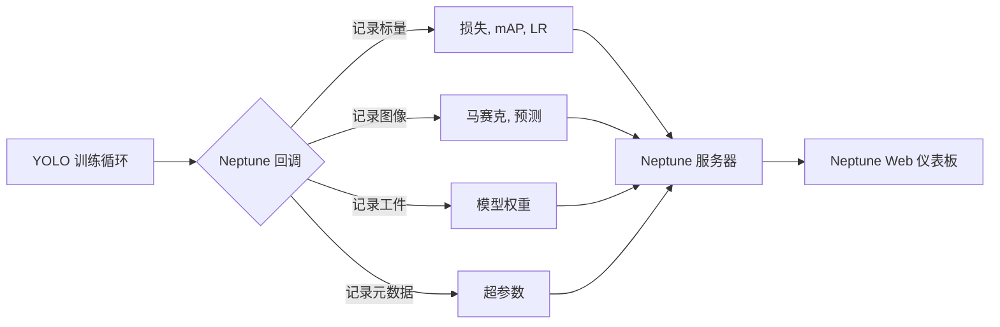

!!! warning "Neptune 收购和 SaaS 停用"

    Neptune 已达成被 OpenAI 收购的协议，并将在 2026 年 3 月 4 日结束的过渡期后停止其托管（SaaS）服务。请查看[官方公告](https://neptune.ai/blog/we-are-joining-openai)并相应规划迁移或导出。

# 使用 Neptune 进行实验跟踪

[Neptune](https://neptune.ai/) 是一个用于 MLOps 的元数据存储，专为运行大量实验的团队构建。它为你提供一个单一的地方来记录、存储、显示、组织、比较和查询所有模型构建元数据。

Ultralytics YOLO11 与 Neptune 集成以简化[实验跟踪](https://www.ultralytics.com/glossary/experiment-tracking)。此集成允许你自动记录训练指标、可视化模型预测和存储模型工件，而无需编写自定义日志记录代码。

<p align="center">
  
</p>

## 关键功能

- **自动日志记录**：自动记录关键训练指标，如框损失、分类损失和 [mAP](https://www.ultralytics.com/glossary/mean-average-precision-map)。
- **图像可视化**：直接在 Neptune 仪表板中查看训练马赛克和验证预测。
- **模型检查点**：在训练结束时自动上传和版本控制你训练的模型权重（`best.pt`）。
- **超参数跟踪**：记录所有配置参数以确保实验的完全可重复性。
- **交互式图表**：可视化混淆矩阵和精确率-召回率曲线以分析模型性能。

## 安装

要将 Neptune 与 Ultralytics 一起使用，你需要安装 `neptune` 客户端包以及 `ultralytics`。

!!! tip "安装"

    === "CLI"

        ```bash
        # 安装所需的包
        pip install ultralytics neptune

        # 在 Ultralytics 设置中启用 Neptune 集成
        yolo settings neptune=True
        ```

## 配置

在开始训练之前，你需要将本地环境连接到你的 Neptune 项目。你需要从 Neptune 仪表板获取 **API Token** 和 **Project Name**。

### 1. 获取凭据

1. 登录 [Neptune.ai](https://neptune.ai/)。
2. 创建新项目（或选择现有项目）。
3. 转到用户菜单并获取你的 **API Token**。


### 2. 设置环境变量

处理凭据最安全的方式是通过环境变量。请注意，Ultralytics Neptune 回调读取 YOLO `project` 参数，不使用 `NEPTUNE_PROJECT`。通过训练命令中的 `project=` 传递完整的 Neptune slug（例如 `workspace/name`）；否则 Neptune 将尝试使用字面默认值 `"Ultralytics"`，运行将失败。

=== "Bash (Linux/Mac)"

    ```bash
    export NEPTUNE_API_TOKEN="your_long_api_token_here" # 必需
    ```

=== "PowerShell (Windows)"

    ```powershell
    $Env:NEPTUNE_API_TOKEN = "your_long_api_token_here"  # 必需
    ```

=== "Python"

    ```python
    import os

    os.environ["NEPTUNE_API_TOKEN"] = "your_long_api_token_here"
    os.environ["NEPTUNE_PROJECT"] = "your_workspace/your_project"
    ```

## 用法

配置完成后，你可以开始训练 YOLO11 模型。当安装了 `neptune` 包并在设置中启用集成时，Neptune 集成会自动工作。

### 训练示例

!!! example "使用 Neptune 日志记录训练 YOLO11"

    === "Python"

        ```python
        from ultralytics import YOLO

        # 加载模型
        model = YOLO("yolo11n.pt")

        # 训练模型
        # 将 Neptune 项目 slug 作为 'project' 参数传递（workspace/name）
        results = model.train(data="coco8.yaml", epochs=10, project="my-workspace/my-project", name="experiment-1")
        ```

    === "CLI"

        ```bash
        # 通过 CLI 训练
        # project 必须是 Neptune slug（workspace/name）；否则运行创建将失败
        yolo train data=coco8.yaml epochs=10 project=my-workspace/my-project name=experiment-1
        ```

## 理解集成

以下图表说明了 Ultralytics 训练管道如何与 Neptune 交互以记录各种工件和指标。



### 记录了什么？

当你运行训练命令时，Neptune 集成会自动在你的运行中捕获以下数据结构：

1. **配置/超参数**：所有训练参数（epochs、lr0、optimizer 等）记录在配置部分下。
2. **配置/模型**：模型架构和定义。
3. **指标**：
    - **训练**：`box_loss`、`cls_loss`、`dfl_loss`、`lr`（学习率）。
    - **指标**：`precision`、`recall`、`mAP50`、`mAP50-95`。
4. **图像**：
    - `Mosaic`：显示数据增强的训练批次。
    - `Validation`：验证数据上的真实标签和模型预测。
    - `Plots`：混淆矩阵、精确率-召回率曲线。
5. **权重**：最终训练的模型（`best.pt`）上传到 Neptune 运行中的 `weights` 文件夹。

## 高级用法

### 组织运行

你可以使用标准的 Ultralytics `project` 和 `name` 参数在 Neptune 中组织你的运行。

- `project`：必须是 Neptune 项目 slug `workspace/name`；这是回调传递给 `neptune.init_run` 的内容。
- `name`：作为特定运行的标识符。

### 自定义日志记录

如果你需要在自动日志记录之外记录额外的自定义指标，你可以访问 Neptune 运行实例。请注意，你需要修改训练器逻辑或创建自定义回调来访问特定的运行对象，因为 Ultralytics 集成在内部处理运行生命周期。

## 常见问题

### 如何禁用 Neptune 日志记录？

如果你已安装 `neptune` 但希望为特定会话或全局禁用日志记录，你可以修改 YOLO 设置。

```bash
# 禁用 Neptune 集成
yolo settings neptune=False
```

### 我的图像没有上传。出了什么问题？

确保你的网络允许连接到 Neptune 的服务器。此外，图像日志记录通常在特定间隔（例如 epoch 结束或训练结束）发生。如果你使用 `Ctrl+C` 提前中断训练，一些最终工件（如混淆矩阵或最佳模型权重）可能不会上传。

### 我可以记录到特定的 Neptune 运行 ID 吗？

当前集成会为每个训练会话自动创建新运行。要恢复记录到现有运行，你通常需要在 Python 代码中手动处理 Neptune 初始化，这超出了自动集成的范围。但是，Ultralytics 支持在本地恢复训练，这将在 Neptune 中创建新运行来跟踪恢复的 epoch。

### 在 Neptune 中哪里可以找到模型权重？

在你的 Neptune 仪表板中，导航到 **Artifacts** 或 **All Metadata** 部分。你会找到一个包含 `best.pt` 文件的 `weights` 文件夹，你可以下载它用于部署。
